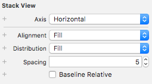

# 5 Design about Login Interface

## 5.1 Login UI effects While Starting

### The Display Mode of the Login Area

* Sets the fill mode in the contents of the Login StackView：



* In the class `LoginViewController`, add override function `viewDidAppear` to realize animation effect:

```swift
override func viewDidAppear(_ animated: Bool) {
        UIView.animate(withDuration: 2) {
            self.loginStackView.axis = .vertical
        }
    }
```

* Final animation effect:

<iframe height=500 width=500 src="PicsForLog/StackView.gifcask">


