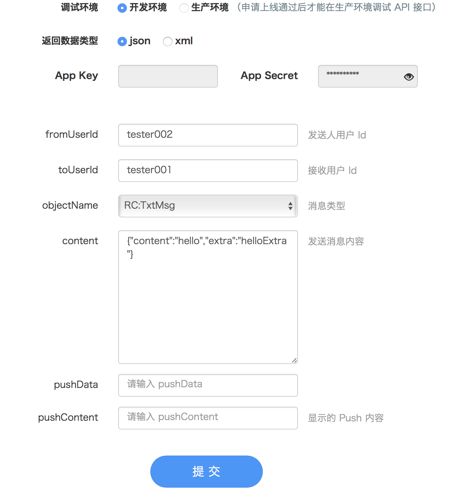
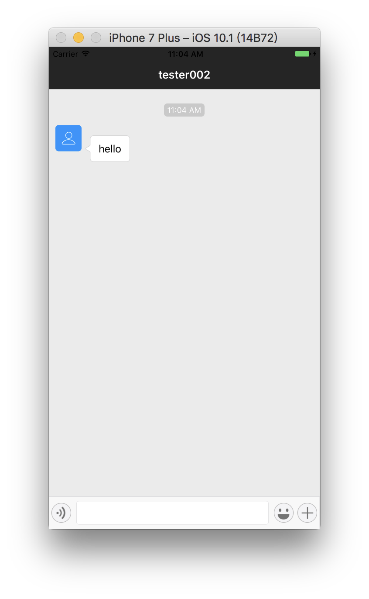
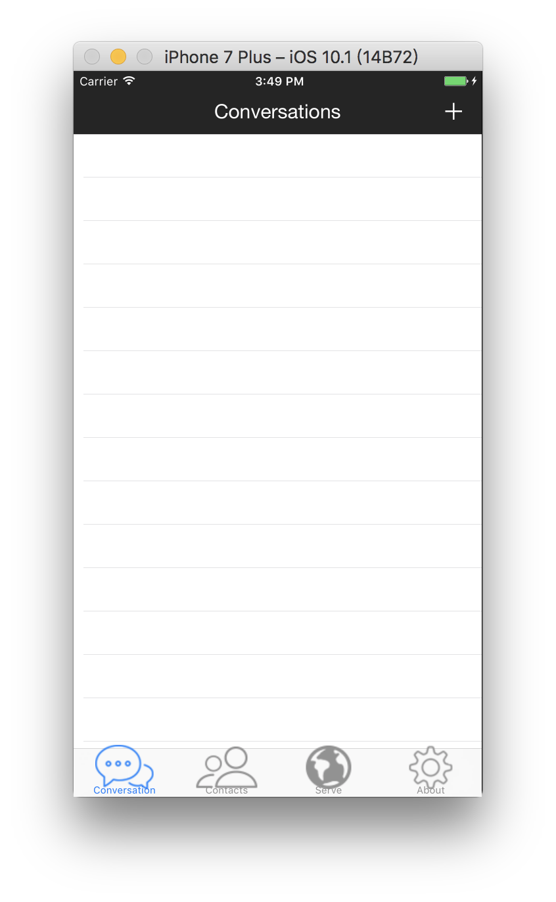
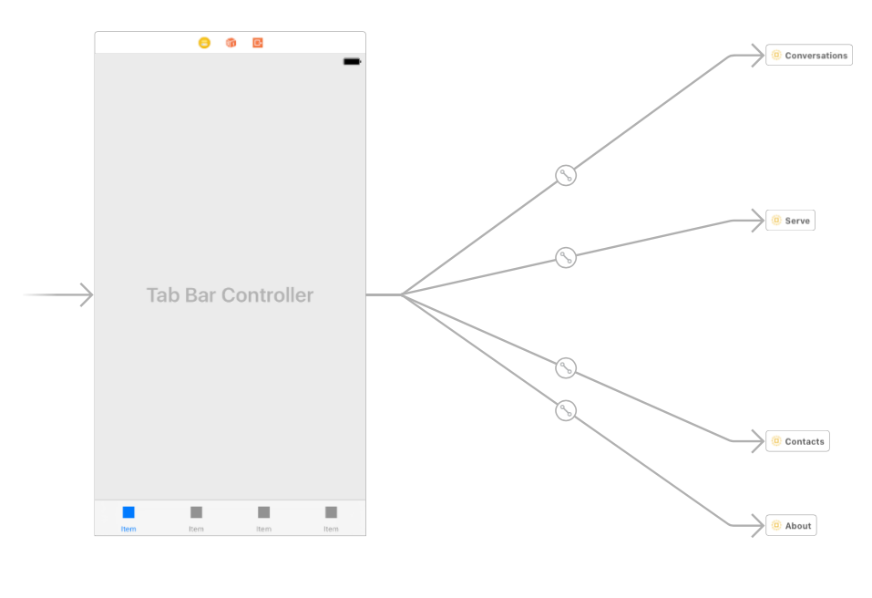

[TOC]

# 3 Chat and Conversation, CocoaPods and Storyboard

## 3.1 Elements of The Project

### User System Flow

* Application
* `RongCloud`(stores information of friend relationship and group relation)
* Server(stores user information)

### Set Current User Information

* User class `RCIMClient`(Singleton, Set the user logging in)

### Private Chatting UI

* User class `RCConversationViewController`(integrated in `RongCloud`)

### Private Chatting User Information

* targetId
* userName
* conversation Type
* navigation bar title

## 3.2 Achievement of Private Chatting

### Main Functions

- Common functions of a single conversation
- Text
- images
- Voice talk
- Send location

### User System Flow Test

View `My Application` on `RongCloud` official website and enter user's basic information in the API debugging section to get the testing token.

### Private Chatting UI

Create class `conversationViewController` inheriting class `RCConversationViewController` from `RongIMKit`:

```swift
class conversationViewController: RCConversationViewController {

    override func viewDidLoad() {
        super.viewDidLoad()

        // Do any additional setup after loading the view.
    }

    override func didReceiveMemoryWarning() {
        super.didReceiveMemoryWarning()
        // Dispose of any resources that can be recreated.
    }
    
}
```

Build and run the current scheme:


## 3.3 Set Up Private Chatting People and Test

### Initialize SDK

Need to add a SDK reference to project's Bridging-Header.h file.

```swift
#import <RongIMKit/RongIMKit.h>
```

Pass App Key,  getted in `RongCloud Development Center`, into function `initWithAppKey` to initialize SDK.

```swift
RCIM.sharedRCIM().initWithAppKey("YourTestAppKey")
```

### Connect Server

Through the RCIM of a single case, introduce the Token getted in the last step into function `RCIM.shared().connect(withToken: String!, success: ((String?) -> Void)!, error: ((RCConnectErrorCode) -> Void)!, tokenIncorrect: (() -> Void)!)`,  and then you can establish a connection with the server.

```swift
RCIM.sharedRCIM().connectWithToken("YourTestUserToken",
success: { (userId) -> Void in
    print("Successfully, ID：\(userId)")
}, error: { (status) -> Void in
    print("Wrong code:\(status.rawValue)")
}, tokenIncorrect: {
    print("Incorrect token.")
})
```

### Start The Chatting Interface

Create a class `ConversationViewController` ，subclass of  `RCConversationViewController` and set property such as `conversationType`, `targetId` and `title` to get start:

```swift
self.targetId = "tester002"
self.title = "tester002"
self.conversationType = .ConversationType_PRIVATE
```

### Test The Conversation

In `My Application`, you can use `API Debug` —> `Send Private Chatting Message` to test the application:





## 3.4 Imporvement of Storyboard

### Tar Bar Controller

Overall



### Refactor to Storyboard



### Navigation Font Style

The Swift code is showed in Class `AppDelegate` 's function ` application(_ application: UIApplication, didFinishLaunchingWithOptions launchOptions: [UIApplicationLaunchOptionsKey: Any]?) -> Bool` as below:

```swift
UINavigationBar.appearance().barTintColor = UIColor(red: 0 / 255, green: 0 / 255, blue: 0 / 255, alpha: 1)
        UINavigationBar.appearance().tintColor = UIColor.white
        
        UIApplication.shared.statusBarStyle = .lightContent
        
        if let barFont = UIFont(name: "Helvetica Neue", size: 20.0) {
            UINavigationBar.appearance().titleTextAttributes = [
                NSForegroundColorAttributeName: UIColor.white,
                           NSFontAttributeName: barFont]
        }
```

## 3.5 Set The Provider of User Information

* Class `AppDelegate` should inherit class `RCIMUserInfoDataSource`:

```swift
class AppDelegate: UIResponder, UIApplicationDelegate, RCIMUserInfoDataSource
```

* And then implement the function `getUserInfo(withUserId userId: String!, completion: ((RCUserInfo?) -> Void)!)` by self:

```swift
// MARK: - RCIM User Info
    
    func getUserInfo(withUserId userId: String!, completion: ((RCUserInfo?) -> Void)!) {
        
        let userInfo = RCUserInfo()
        userInfo.userId = userId
        
        
        switch userId {
        case "tester001":
            userInfo.name = "tester1"
            userInfo.portraitUri = "https://ss0.baidu.com/73t1bjeh1BF3odCf/it/u=1756054607,4047938258&fm=96&s=94D712D20AA1875519EB37BE0300C008"
        case "tester002":
            userInfo.name = "tester2"
            userInfo.portraitUri = "http://v1.qzone.cc/avatar/201407/27/09/23/53d45474e1312012.jpg!200x200.jpg"
        default:
            print(NSLocalizedString("User doesn't exist.", comment: "No user"))
        }
        
        completion(userInfo)
    }
```

* Set class `AppDelegate` as the `RCIM` data source in function `application( _:didFinishLaunchingWithOptions)  `:

```swift
RCIM.shared().userInfoDataSource = self
```

## 3.6 Display Conversation List Content-Asynchronous Connection

### Modification in AppDelegate

Add a new function `connectServer(_:)` some of whose statements are extracted from function `application(_: didFinishLaunchingWithOptions:)`:

```swift
func connectServer(_ completion: @escaping () -> Void) {
        
        RCIM.shared().initWithAppKey("Your App Key")
        
        RCIM.shared().connect(withToken: "YourToken", success: {
            (userID) in
            
            print(NSLocalizedString("Connect successfully \(userID!)", comment: "successfull connection notice"))
            
            DispatchQueue.main.async(execute: { 
                completion()
            })
            
            
        }, error: {
            (_) in
            print(NSLocalizedString("Connection failed", comment: "unsuccessful connection warning"))
        }, tokenIncorrect: {
            print(NSLocalizedString("Token is incorrect or invalid", comment: "Incorrect token notice"))
        })
    }
```

More knowledge about escaping closure: [Escaping and Nonescaping Closures in Swift 3](References/Escaping and Nonescaping Closures in Swift 3.md)

### Modification in ConversationList

In class `ConversationListViewController`'s function `viewDidLoad()` ,we should add statements like that to implement asynchronized connection:

```swift
let delegate = UIApplication.shared.delegate as? AppDelegate
        
        delegate?.connectServer {
            self.title = NSLocalizedString("Connected", comment: "Conversation lisst Connected title")
            self.reloadInputViews()
        }
```

