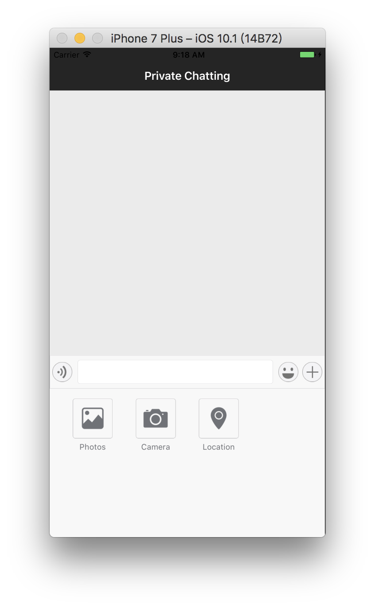

[TOC]

# 3 Chat and Conversation, CocoaPods and Storyboard

## 3.1 Elements of The Project

### User System Flow

* Application
* `RongCloud`(stores information of friend relationship and group relation)
* Server(stores user information)

### Set Current User Information

* User class `RCIMClient`(Singleton, Set the user logging in)

### Private Chatting UI

* User class `RCConversationViewController`(integrated in `RongCloud`)

### Private Chatting User Information

* targetId
* userName
* conversation Type
* navigation bar title

## 3.2 Achievement of Private Chatting

### Main Functions

- Common functions of a single conversation
- Text
- images
- Voice talk
- Send location

### User System Flow Test

View `My Application` on `RongCloud` official website and enter user's basic information in the API debugging section to get the testing token.

### Private Chatting UI

Create class `conversationViewController` inheriting class `RCConversationViewController` from `RongIMKit`:

```swift
class conversationViewController: RCConversationViewController {

    override func viewDidLoad() {
        super.viewDidLoad()

        // Do any additional setup after loading the view.
    }

    override func didReceiveMemoryWarning() {
        super.didReceiveMemoryWarning()
        // Dispose of any resources that can be recreated.
    }
    
}
```

Build and run the current scheme:


