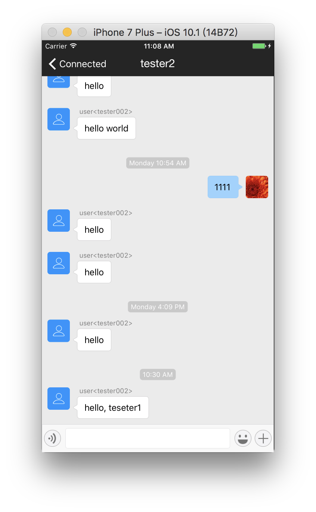

[TOC]

# 4 Third Party Libraries

## 4.1 Fix Some UI Bugs

### Fix Some bugs of Tab Button Image

Adjust the image to the appropriate `Image Set`, showed as below:


## 4.2 How to Find Good Third-Party Libraries

* Use the CocoaPods command:

```shell
$ pod search [LibraryName]
```

* Recommendation from Others.
* Vist the website: `CocoaPods.org`. For example, you can find third-party libraries such as web and UI on this site:


## 4.3 KxMenu

### Preparation

Add one line in file `Podfile`, and the final file is:

```
target 'CloudIMTest' do
    pod 'RongCloudIMKit'
    pod 'KxMenu', '~> 1'
end
```

Save and quict file `Podfile` and then use `CocoaPods command` to install the library:

```shell
$ pod install
```

### Menu

Establish action connection between Add `UIBarButtonItem` and class `ConversationListViewController`:

```swift
@IBAction func showMenu(_ sender: UIBarButtonItem) {
        
        var frame = (sender.value(forKey: "view") as? UIView)?.frame
        frame?.origin.y += 30
        
        KxMenu.show(in: self.view, from: frame!, menuItems: [
            KxMenuItem(NSLocalizedString("Test1", comment: "Test1"),image: UIImage(named: "contact"), target:self, action: "ClickMenu1"),
            KxMenuItem(NSLocalizedString("Test2", comment: "Test2"),image: UIImage(named: "contact"), target:self,action: "ClickMenu2")
            ])
        
    }
```


### Push ViewController Test

After tapping on Add `UIBarButtonItem`, navigation controller push the specified view controller(using 2 different methods to realize this function):

```swift
func ClickMenu1() {
        conversationViewController.targetId = "tester001"
        conversationViewController.title = "tester1"
        conversationViewController.conversationType = .ConversationType_PRIVATE
        
        performSegue(withIdentifier: "ShowConversationVC", sender: self)
    }
    
func ClickMenu2() {
        
        let conversationVC = RCConversationViewController()
        
        conversationVC.targetId = "tester002"
        conversationVC.title = "tester2"
        conversationVC.conversationType = .ConversationType_PRIVATE
        
        navigationController?.pushViewController(conversationVC, animated: true)
        
        tabBarController?.tabBar.isHidden = true
        
    }
```



## 4.4 Full-Screen Animated Menu

### PopMenu

An interesting third-party library.

PopMenu is pop animation menu inspired by Sina weibo / NetEase app.

### Preparation

Add one line in file `Podfile`, and the final file is:

```
target 'CloudIMTest' do
    pod 'RongCloudIMKit'
    pod 'KxMenu', '~> 1'
    pod 'PopMenu', '~> 2.4'
end
```

Save and quict file `Podfile` and then use `CocoaPods command` to install the library:

```shell
$ pod install
```

### Achievement in Code

Concrete code and the final result:

```swift
@IBAction func showMenu(_ sender: UIBarButtonItem) {
        
        let items = [
            MenuItem(title: "Serve", iconName: "serve", glow: UIColor.blue, index: 0),
            MenuItem(title: "About", iconName: "about", glow: UIColor.blue, index: 1)
        ]
        
        let menu = PopMenu(frame: self.view.bounds, items: items)
        
        menu?.menuAnimationType = .sina
        
        menu?.didSelectedItemCompletion = { (selectedItem) in
            
            print(selectedItem!.title)
            
        }
        
        menu?.show(at: self.view)
    }
```


## 4.5 StackView

Build login interface with StackView:


## 4.6 Real-Time Rendering of Storyboard

### CornerRadius and Border of Object

Create class `RoudImageView` and associate it with the image of the login interface. Write the program as follows:

```swift
import UIKit

@IBDesignable
class RoundImageView: UIImageView {
    
    @IBInspectable var cornerRadius: CGFloat = 0 {
        didSet {
            layer.cornerRadius = cornerRadius
            layer.masksToBounds = (cornerRadius > 0)
          
        }
    }
    
    @IBInspectable var borderWidth: CGFloat = 0 {
        didSet {
            layer.borderWidth = borderWidth
        }
    }
    
    @IBInspectable var borderColor: UIColor? {
        didSet {
            layer.borderColor = borderColor?.cgColor
        }
    }

}
```

`masksToBounds` is the function of the `CALayer` class; `clipsToBounds` is the function of the `UIView` class and will eventually call the `masksToBounds` method. So use `masksToBounds` to conserve resources a little.

### Real-time effects

You can modify the parameters in the sidebar and preview the effect in real time on the storyboard.


