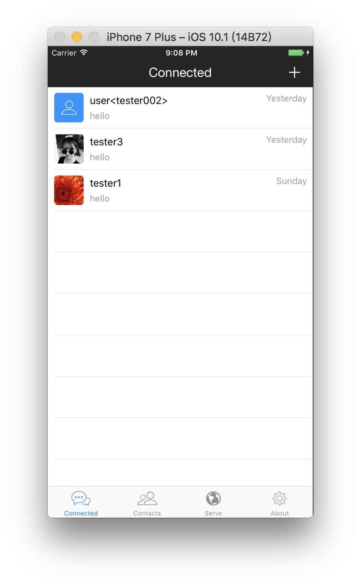

# 4 Third Party Libraries

## 4.1 Fix Some UI Bugs

### Fix Some bugs of Tab Button Image

Adjust the image to the appropriate `Image Set`, showed as below:



## 4.2 How to Find Good Third-Party Libraries

* Use the CocoaPods command:

```shell
$ pod search [LibraryName]
```

* Recommendation from Others.
* Vist the website: `CocoaPods.org`. For example, you can find third-party libraries such as web and UI on this site:


