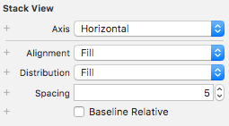

[TOC]

# 5 Design about Login Interface

## 5.1 Login UI effects While Starting

### The Display Mode of the Login Area

* Sets the fill mode in the contents of the Login StackView：



* In the class `LoginViewController`, add override function `viewDidAppear` to realize animation effect:

```swift
override func viewDidAppear(_ animated: Bool) {
        UIView.animate(withDuration: 2) {
            self.loginStackView.axis = .vertical
        }
    }
```

* Final animation effect:


## 5.2 Background Wallpaper Scrolling effect

### Overall Effect


### The Code that Implements this Effect

* Let class `LoginViewController` inherit from class `RCAnimatedImagesViewDelegate` and override its function `animatedImagesNumber` and `animatedImagesView`:

```swift
class LoginViewController: UIViewController, RCAnimatedImagesViewDelegate

func animatedImagesNumber(ofImages animatedImagesView: RCAnimatedImagesView!) -> UInt {
        return 3
    }
    
func animatedImagesView(_ animatedImagesView: RCAnimatedImagesView!, imageAt index: UInt) -> UIImage! {
        let imageNames = ["image1", "image2", "image3"]
        let intIndex = Int(index)
        return UIImage(named: imageNames[intIndex])
    }
```

* set wallpaper’s delegate as `self` and then start this animation:

```swift
override func viewDidLoad() {
        super.viewDidLoad()

        // Do any additional setup after loading the view.
        
        wallpaperImageView.delegate = self
        wallpaperImageView.startAnimating()
    }
```

## 5.3 UITalbeView of Registration

### Implement Code

* Emb `NavigationBar`.
* Show segue from `Login View Controller` to `Registration Tabble View Controller`.
* Hid `Navigation` in `Login View` and show it in `Registration TableView`.
* Edit Registration Table View.


```swift
//In class `LoginViewController`
override func viewWillAppear(_ animated: Bool) {
        super.viewWillAppear(animated)
        navigationController?.isNavigationBarHidden = true
}
```

```swift
//In class `RegistrationTableViewController`:
override func viewDidLoad() {
        super.viewDidLoad()

        self.navigationController?.isNavigationBarHidden = false
        title = "Registration"
}
```

### Final Result


## 5.4 Object Constraints

### Implement Points

* Set the `Text Field` keyboard type.
* Add new objects' constraints and alignment constraints.
* Add `rightBarButtonItem` for `RegistrationTableView` without `navigation controller` embed in:

```swift
override func viewDidLoad() {
        super.viewDidLoad()

        self.navigationItem.rightBarButtonItem = UIBarButtonItem(barButtonSystemItem: UIBarButtonSystemItem.done, target: self, action: #selector(RegistrationTableViewController.doneButtonTap))
}

func doneButtonTap() {
        
        let alert = UIAlertController(title: "Alert", message: "You've tapped up on the Done Button", preferredStyle: .alert)
        
        let action = UIAlertAction(title: "OK", style: .default, handler: nil)
        
        alert.addAction(action)
        
        present(alert, animated: true, completion: nil)

}
```

### Result

